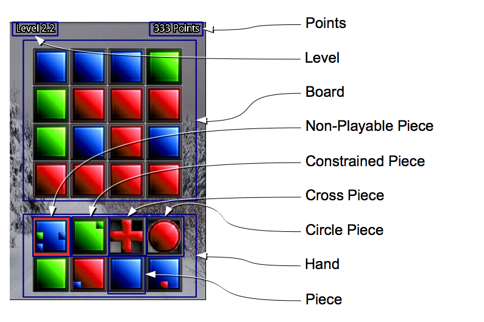

# Elemental

[Play Online](https://ihavenoparachute.com/elemental)
				

## Rules

A puzzle game for those who enjoy a logical challenge.
The object is to see how many tiles you can place, thus getting as high of a score as you can. Tiles can only be played if the pattern on the tile matches the pattern on the board where the tile is placed.

-	The object is to gain as many points as you can.
-	Place a piece from your hand to the board to gain points.
-	Every ten pieces played produces a raise in level.
-	Certain pieces have constraints on where they can be played.  These constraints show what the neighboring tiles must be for this piece to be placed on a specific tile.
-	The higher level you are the more points you will gain for placing a piece, yet the more constraints a piece may have.
-	Certain pieces will change more than the color of the tile where they are placed.
	-	The cross-shaped piece changes the colors of tiles above, below, to the left, and right of where they are placed.
	-	The circle-shaped piece changes the colors of all connected tiles with colors matching the tile where it was placed.

## Controls
-	Drag a tile from your hand to the board to place it on the board.
-	Drag the board to rotate the board.

## Bonuses
-	Place piece on its same color and you will get a bonus.
-	Place a piece with a constraint that uses the tile that the last piece was placed on and you will get a bonus.
-	Fill a column or a row with all of the same color and you will get a bonus.
-	Fill the entire board all of the same color and you will get a bigger bonus.  The board will reset itself with random colored tiles as well.
